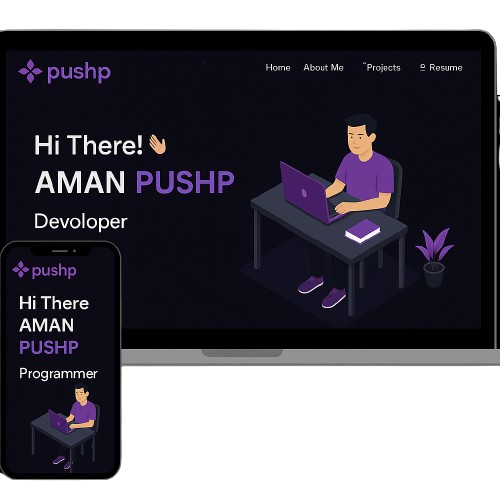

<p align="center">
  
</p>

<h1 align="center">
  🚀 Personal Portfolio<br>
  
</h1>

<p align="center">
  
  
  
</p>

---

## ✨ Preview
<div align="center">
 

</div>


> 🎥 *Live animations, smooth transitions, and a space-age UI built with love.*

---

## 🚀 Features

- ⚡ Smooth page transitions with Framer Motion
- 💡 Light/Dark theme toggle
- 📱 Fully responsive design for mobile/tablet/desktop
- 🌐 Modern UI with Glassmorphism/Neumorphism aesthetics
- 🧠 Well-structured components and modular CSS

---

## 🛠 Tech Stack

| Tech           | Description                    |
|----------------|--------------------------------|
| **React.js**   | UI Framework                   |
| **Framer Motion** | Animations & Transitions    |
| **Tailwind CSS**  | Utility-first styling        |
| **React Icons**   | Iconography                  |
| **Netlify/Vercel** | Hosting & Deployment       |

---

## 🚧 Project Setup

```bash
# Clone the project
git clone https://github.com/AMANPUSHP23/Newportfolio.git

# Navigate to project
cd portfolio

# Install dependencies
npm install

# Start development server
npm run dev


🌍 Live Demo
🔗 Click here to see it live
Replace with your deployed site URL

📦 Deployment Options
 Netlify

 Vercel

 GitHub Pages (with static export)

👨‍🚀 Author
Aman Pushp


## 🌐 Let's Connect

[](https://www.linkedin.com/in/aman-pushp-b1a501223/)
[](https://github.com/AMANPUSHP23)
[](https://www.instagram.com/aman_pushp23/?hl=en)

📄 License
This project is licensed under the MIT License — see the LICENSE file for details.

⭐ Show Your Support
If you like this project, please ⭐ the repo and share it with friends!
Let’s connect the tech world with a futuristic touch ✨


